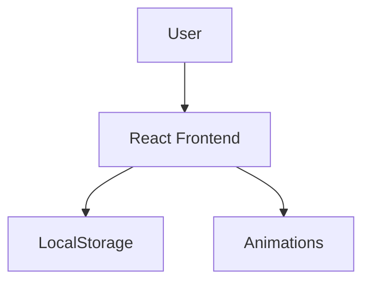

# 🔑 Password Manager

A **secure, animated, and responsive** password manager built with **React, Local Storage**, and **Framer Motion** for smooth animations. Manage and store your passwords locally without compromising security!

---

## 📌 Features

✅ **Generate Strong Passwords** – One-click generation with adjustable length & complexity.  
✅ **Store Passwords Locally** – Uses **LocalStorage** to keep your data safe in the browser.  
✅ **Beautiful UI & Animations** – Smooth **Framer Motion** transitions & modern design.  
✅ **Secure & Masked Passwords** – Toggle password visibility with a click.  
✅ **Fully Responsive** – Works on **desktop, tablet, and mobile devices**.  

---

## 🖼️ Preview & Screenshots

### 📌 Live View:


### 🔥 Animated Password Cards:


### 🔧 Vault Passwords:


---

## 🛠️ Tech Stack

🔹 **React** – Frontend framework  
🔹 **LocalStorage** – For storing passwords securely in the browser  
🔹 **Framer Motion** – Smooth animations & transitions  
🔹 **Tailwind CSS** – For a sleek and modern UI  

---

## 🚀 Installation & Setup

### 🔧 Clone the Repository:
```bash
 git clone https://github.com/sahil1476/Password-Generator.git
 cd Password-Generator
```

### 📦 Install Dependencies:
```bash
 npm install
```

### ▶️ Run the App:
```bash
 npm run dev
```

> **Note:** Your passwords are stored **locally** in the browser's `localStorage`. Make sure to back up important data!

---

## 🖥️ Architecture Diagram



---

## 🎨 UI Components Overview

```mermaid
graph TD;
    Sidebar-->Buttons;
    Buttons-->GeneratePassword;
    Buttons-->ViewPassword;
    Vault-->PasswordCards;
    PasswordCards-->Copy / Delete;
```

---

## 📜 License

This project is **open-source** and available for public use.

---


